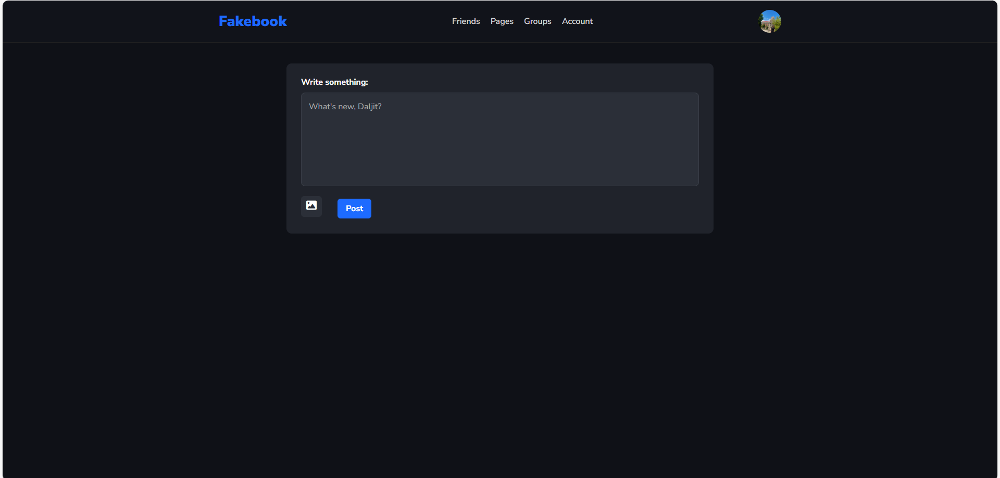
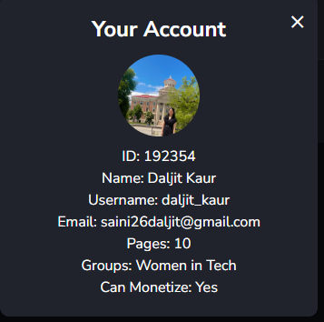

# **Fakebook – Social Media App**

This is a simple social network-like web page called Fakebook. Users can post text and images, and view user account information through a pop-up modal.
##  Live Demo  
**View the App Here:** 
http://127.0.0.1:5500/daljit_kaur_oojs_assignment_3/index.html
 

##  **Features**

- **Create Posts** with text and/or images  
- Prevents **empty posts**  
- Each post displays **name, profile image, and date**  
- **User Info Modal** showing account + subscriber details  
- Uses **User & Subscriber classes** (private fields + getters)  
- Fully **responsive** design  
- ES6 **Modules + Clean Folder Structure**
## 📸 **Screenshots**

**Post Feed Example**  

**User Modal**  
              Click the profile icon to open modal.  
              Displayed details include:
- ID  
- Full Name  
- Username  
- Email  
- Pages (array)  
- Groups (array)  
- Monetization status 

##  **Tech Stack**

- **HTML5**  
- **CSS3**  
- **JavaScript (ES6 Modules)**  

---
##  Live 
